# Deep Research Agent - Implementation Plan
## LangGraph + Streamlit + Gemini (Google)

**Document Version:** 1.0  
**Date:** December 8, 2025  
**Status:** DESIGN PHASE - Awaiting Review & Approval

---

## 📋 Table of Contents

1. [Executive Summary](#executive-summary)
2. [Architecture Overview](#architecture-overview)
3. [LangGraph Flow Chart](#langgraph-flow-chart)
4. [State Schema Definition](#state-schema-definition)
5. [Node Specifications](#node-specifications)
6. [Parallel Execution Strategy](#parallel-execution-strategy)
7. [Retry & Fallback Mechanisms](#retry--fallback-mechanisms)
8. [Checkpointing Strategy](#checkpointing-strategy)
9. [Context Window Management](#context-window-management)
10. [File Structure](#file-structure)
11. [Dependencies & Environment](#dependencies--environment)
12. [Implementation Phases](#implementation-phases)
13. [Testing Strategy](#testing-strategy)

---

## 1. Executive Summary

### Goal
Build a production-grade Deep Research Agent that:
- Takes company name input with HITL (Human-In-The-Loop) verification
- Retrieves financial data from SEC EDGAR
- Performs deep web research using Tavily (primary) and DDGS (fallback)
- Extracts news, sentiment, and competitor analysis
- Synthesizes insights using Google Gemini LLM
- Generates downloadable research reports

### Key Differentiators
- **Parallel Execution:** Independent research tasks run concurrently
- **Resilience:** Retry logic, fallbacks, and checkpointing
- **Gemini Integration:** Uses Google's Gemini Pro/Flash for synthesis
- **Schema Validation:** Pydantic models ensure data integrity
- **Context Management:** Intelligent chunking and summarization

---

## 2. Architecture Overview

```
┌─────────────────────────────────────────────────────────────────┐
│                        STREAMLIT UI LAYER                        │
│  (User Input → HITL Selection → Progress Display → Report View) │
└────────────────────┬────────────────────────────────────────────┘
                     │
                     ▼
┌─────────────────────────────────────────────────────────────────┐
│                    LANGGRAPH ORCHESTRATION                       │
│  ┌──────────────┐  ┌──────────────┐  ┌──────────────┐          │
│  │ Checkpoint   │  │    Retry     │  │  Fallback    │          │
│  │   Manager    │  │   Handler    │  │   Handler    │          │
│  └──────────────┘  └──────────────┘  └──────────────┘          │
└────────────────────┬────────────────────────────────────────────┘
                     │
        ┌────────────┼────────────┐
        ▼            ▼            ▼
┌──────────────┐ ┌──────────────┐ ┌──────────────┐
│  SEC Data    │ │  Web Search  │ │    Gemini    │
│   Module     │ │   Module     │ │  LLM Module  │
└──────────────┘ └──────────────┘ └──────────────┘
   (SEC API)      (Tavily/DDGS)    (Google AI)
```

### Technology Stack
- **Orchestration:** LangGraph (StateGraph + Built-in Checkpointing)
- **LLM:** Google Gemini Pro 1.5 / Flash 2.0
- **UI:** Streamlit
- **Data Retrieval:** SEC EDGAR API, Tavily SDK, DDGS
- **Validation:** Pydantic v2
- **Persistence:** SQLite (automatic checkpoints via thread_id), JSON (reports)

### Checkpointing Strategy
- **Thread ID = Company Name** (normalized): `"Apple Inc." → "apple_inc"`
- **Automatic Persistence**: LangGraph saves state after every node
- **Resume Capability**: Interrupted research can be resumed seamlessly
- **HITL Support**: Natural pause/resume for human selections
- **Multi-Company**: Concurrent research tracked independently

---

## 3. LangGraph Flow Chart

```mermaid
graph TD
    START([User Input: Company Name]) --> LOAD_TICKERS[Load SEC Tickers]
    
    LOAD_TICKERS --> FUZZY_MATCH[Fuzzy Match Companies]
    FUZZY_MATCH --> HITL{Human Selection}
    
    HITL -->|User Selects| RESOLVE[Resolve Company CIK]
    
    RESOLVE --> CHECKPOINT_1[💾 Checkpoint: Company Resolved]
    
    CHECKPOINT_1 --> PARALLEL_FINANCIAL[🔀 Parallel Branch START]
    
    PARALLEL_FINANCIAL --> SEC_FETCH[Fetch SEC Data<br/>companyfacts + submissions]
    PARALLEL_FINANCIAL --> WEB_PROFILE[Web: Company Profile<br/>Tavily → DDGS fallback]
    PARALLEL_FINANCIAL --> NEWS_SEARCH[Web: News & Events<br/>Tavily → DDGS fallback]
    
    SEC_FETCH --> EXTRACT_FIN[Extract Financials<br/>Income/Balance/Cashflow]
    
    WEB_PROFILE --> CHECKPOINT_2A[💾 Profile Ready]
    NEWS_SEARCH --> CHECKPOINT_2B[💾 News Ready]
    EXTRACT_FIN --> CHECKPOINT_2C[💾 Financials Ready]
    
    CHECKPOINT_2A --> PARALLEL_DEEP[🔀 Parallel Deep Research]
    CHECKPOINT_2B --> PARALLEL_DEEP
    CHECKPOINT_2C --> PARALLEL_DEEP
    
    PARALLEL_DEEP --> SENTIMENT[Social Sentiment<br/>Reddit/Twitter/Forums]
    PARALLEL_DEEP --> COMPETITORS[Competitor Analysis<br/>Market Context]
    PARALLEL_DEEP --> INVESTOR_DOCS[Investor Materials<br/>10-K/10-Q/Presentations]
    
    SENTIMENT --> CHECKPOINT_3[💾 All Research Complete]
    COMPETITORS --> CHECKPOINT_3
    INVESTOR_DOCS --> CHECKPOINT_3
    
    CHECKPOINT_3 --> VALIDATE[Schema Validation<br/>Pydantic Models]
    
    VALIDATE --> CONTEXT_PREP[Context Window Prep<br/>Chunking + Summarization]
    
    CONTEXT_PREP --> GEMINI_SYNTHESIS[🤖 Gemini Synthesis<br/>Executive Summary<br/>Insights & Risks]
    
    GEMINI_SYNTHESIS --> FINAL_REPORT[Generate Final Report<br/>Markdown + JSON]
    
    FINAL_REPORT --> END([📊 Display in Streamlit])
    
    %% Error Handling
    LOAD_TICKERS -.->|Retry 3x| LOAD_TICKERS
    SEC_FETCH -.->|Retry 3x| SEC_FETCH
    WEB_PROFILE -.->|Tavily Fail → DDGS| WEB_PROFILE
    NEWS_SEARCH -.->|Tavily Fail → DDGS| NEWS_SEARCH
    GEMINI_SYNTHESIS -.->|Rate Limit → Exponential Backoff| GEMINI_SYNTHESIS
    
    style HITL fill:#ffeb3b,stroke:#f57f17,stroke-width:3px
    style CHECKPOINT_1 fill:#4caf50,stroke:#2e7d32,stroke-width:2px
    style CHECKPOINT_2A fill:#4caf50,stroke:#2e7d32,stroke-width:2px
    style CHECKPOINT_2B fill:#4caf50,stroke:#2e7d32,stroke-width:2px
    style CHECKPOINT_2C fill:#4caf50,stroke:#2e7d32,stroke-width:2px
    style CHECKPOINT_3 fill:#4caf50,stroke:#2e7d32,stroke-width:2px
    style PARALLEL_FINANCIAL fill:#2196f3,stroke:#0d47a1,stroke-width:2px
    style PARALLEL_DEEP fill:#2196f3,stroke:#0d47a1,stroke-width:2px
    style GEMINI_SYNTHESIS fill:#9c27b0,stroke:#4a148c,stroke-width:3px
```



### Flow Explanation

#### Phase 1: Company Resolution (Sequential)
1. **Load SEC Tickers** - Download company_tickers.json (cached daily)
2. **Fuzzy Match** - Generate top 3-5 matches using difflib
3. **HITL** - User selects correct company
4. **Resolve CIK** - Extract CIK and format to 10 digits
5. **Checkpoint 1** - Save resolved company state

#### Phase 2: Parallel Data Acquisition (Concurrent)
Three parallel branches execute simultaneously:
- **Branch A:** SEC companyfacts + submissions → Extract financials
- **Branch B:** Web company profile (Tavily/DDGS)
- **Branch C:** News timeline (Tavily/DDGS)

Each branch has independent retry/fallback logic.

#### Phase 3: Parallel Deep Research (Concurrent)
After Phase 2 completes, three more parallel tasks:
- **Sentiment Analysis** - Social media scraping + VADER
- **Competitor Mapping** - Related companies + market context
- **Investor Docs** - 10-K/10-Q/presentations extraction

#### Phase 4: Synthesis (Sequential)
1. **Schema Validation** - Ensure all data conforms to Pydantic models
2. **Context Preparation** - Intelligent chunking for Gemini's context window
3. **Gemini Synthesis** - Generate executive summary, insights, risks
4. **Report Generation** - Markdown + JSON output

---

## 4. State Schema Definition

### Core State Model (Pydantic)

```python
from pydantic import BaseModel, Field, validator
from typing import Optional, List, Dict, Any, Literal
from datetime import datetime
from enum import Enum

class PipelineStatus(str, Enum):
    """Workflow status tracking"""
    INITIALIZING = "initializing"
    AWAITING_HITL = "awaiting_hitl"
    FETCHING_DATA = "fetching_data"
    RESEARCH_IN_PROGRESS = "research_in_progress"
    SYNTHESIZING = "synthesizing"
    COMPLETED = "completed"
    FAILED = "failed"

class CompanyMatch(BaseModel):
    """Company match option for HITL"""
    title: str
    ticker: str
    cik_str: str
    cik10: Optional[str] = None
    
    @validator('cik10', always=True)
    def compute_cik10(cls, v, values):
        if v is None and 'cik_str' in values:
            return f"{int(values['cik_str']):010d}"
        return v

class FinancialMetric(BaseModel):
    """Single financial metric"""
    element: str
    value: Optional[float] = None
    date: Optional[str] = None
    unit: str = "USD"
    form_type: Optional[str] = None

class FinancialStatements(BaseModel):
    """Extracted financial statements"""
    income_statement: Dict[str, Optional[FinancialMetric]]
    balance_sheet: Dict[str, Optional[FinancialMetric]]
    cashflow: Dict[str, Optional[FinancialMetric]]
    extraction_date: datetime = Field(default_factory=datetime.utcnow)

class SearchResult(BaseModel):
    """Normalized search result"""
    title: str
    url: str
    snippet: Optional[str] = None
    domain: Optional[str] = None
    published_date: Optional[str] = None
    content: Optional[str] = None
    source: Literal["tavily", "ddgs"] = "tavily"

class CompanyProfile(BaseModel):
    """Company profile data"""
    description: str = ""
    profile_url: Optional[str] = None
    investor_docs: List[Dict[str, str]] = []
    founded: Optional[str] = None
    industry: Optional[str] = None
    employees: Optional[int] = None

class SentimentAggregate(BaseModel):
    """Aggregated sentiment scores from LLM analysis"""
    total_analyzed: int = 0
    bullish: int = 0
    bearish: int = 0
    neutral: int = 0
    mixed: int = 0
    confidence_avg: float = 0.0
    top_themes: List[tuple[str, int]] = []  # (theme, frequency)
    
    @property
    def bullish_ratio(self) -> float:
        if self.total_analyzed == 0:
            return 0.0
        return self.bullish / self.total_analyzed
    
    @property
    def bearish_ratio(self) -> float:
        if self.total_analyzed == 0:
            return 0.0
        return self.bearish / self.total_analyzed
    
    @property
    def net_sentiment(self) -> float:
        """Net sentiment score: bullish - bearish"""
        return self.bullish_ratio - self.bearish_ratio

class ResearchState(BaseModel):
    """Complete graph state - main state object"""
    # Input
    company_name: str = ""
    
    # Pipeline status
    status: PipelineStatus = PipelineStatus.INITIALIZING
    current_node: str = "start"
    error_message: Optional[str] = None
    
    # Company resolution
    company_tickers: List[Dict[str, Any]] = []
    match_options: List[CompanyMatch] = []
    human_response: Optional[str] = None
    found: Optional[CompanyMatch] = None
    cik10: Optional[str] = None
    
    # SEC data
    companyfacts: Dict[str, Any] = {}
    submissions: Dict[str, Any] = {}
    financials_1yr: Optional[FinancialStatements] = None
    
    # Web research
    company_profile: Optional[CompanyProfile] = None
    news_timeline: List[SearchResult] = []
    social_sentiment: Optional[Dict[str, Any]] = None
    competitors: List[Dict[str, Any]] = []
    
    # Synthesis
    synthesis_prompt: Optional[str] = None
    synthesized_insights: Optional[str] = None
    final_report: Optional[str] = None
    
    # Metadata
    execution_start: datetime = Field(default_factory=datetime.utcnow)
    execution_end: Optional[datetime] = None
    retry_counts: Dict[str, int] = {}
    checkpoint_ids: List[str] = []
    
    class Config:
        arbitrary_types_allowed = True
```

---

## 5. Node Specifications

### 5.1 Sequential Nodes

#### Node: `load_company_tickers`
**Purpose:** Load and cache SEC company_tickers.json  
**Inputs:** None  
**Outputs:** `state.company_tickers`  
**Retry:** 3 attempts with exponential backoff  
**Cache:** 24 hours (daily refresh)  
**Error Handling:** Fallback to local cached copy if available

```python
@retry(max_attempts=3, backoff_factor=2)
@cache(ttl_hours=24)
def node_load_company_tickers(state: ResearchState) -> ResearchState:
    """Load SEC tickers with caching and retry"""
    pass
```

#### Node: `fuzzy_match_companies`
**Purpose:** Generate top match candidates  
**Inputs:** `state.company_name`, `state.company_tickers`  
**Outputs:** `state.match_options` (List[CompanyMatch])  
**Logic:**
- Use `difflib.get_close_matches` with cutoff=0.55
- Return top 5 matches
- Fallback: substring search if no fuzzy matches
- Validation: Ensure at least 1 match or raise `NoMatchError`

#### Node: `human_confirm_match` (HITL)
**Purpose:** Pause for user selection  
**Inputs:** `state.match_options`  
**Outputs:** `state.status = AWAITING_HITL`, `user_prompt`  
**Behavior:** Return control to Streamlit UI

#### Node: `resolve_company_selection`
**Purpose:** Parse user choice and set resolved company  
**Inputs:** `state.human_response`, `state.match_options`  
**Outputs:** `state.found`, `state.cik10`  
**Validation:** Ensure valid index, raise `InvalidSelectionError` if not

---

### 5.2 Parallel Execution Nodes

#### Parallel Group 1: Initial Data Acquisition

##### Node: `fetch_sec_data`
**Purpose:** Download companyfacts and submissions  
**Inputs:** `state.cik10`  
**Outputs:** `state.companyfacts`, `state.submissions`  
**Retry:** 3 attempts  
**Timeout:** 30 seconds per request  
**Rate Limit:** 10 requests/second (SEC limit)

```python
@retry(max_attempts=3, backoff_factor=2)
@timeout(seconds=30)
async def fetch_sec_data(state: ResearchState) -> ResearchState:
    """Async fetch with retry and timeout"""
    pass
```

##### Node: `fetch_company_profile`
**Purpose:** Get company overview from web  
**Inputs:** `state.found.title`  
**Outputs:** `state.company_profile`  
**Retrieval Strategy:**
1. Try Tavily with domain filters (wikipedia.org, company IR page)
2. If Tavily fails → DDGS fallback
3. Extract and clean HTML to markdown
**Retry:** 2 attempts per source

##### Node: `fetch_news_timeline`
**Purpose:** Collect recent news  
**Inputs:** `state.found.title`  
**Outputs:** `state.news_timeline`  
**Strategy:**
1. Tavily news search (max_results=20)
2. DDGS news fallback
3. Deduplicate by URL
4. Parse dates (best effort)

---

#### Parallel Group 2: Deep Research

##### Node: `analyze_social_sentiment`
**Purpose:** Scrape and analyze social mentions using LLM  
**Inputs:** `state.found.title`  
**Outputs:** `state.social_sentiment`  
**Sources:** Reddit, Twitter/X, StockTwits, investor forums  
**Sentiment Analysis:** Gemini Flash for fast batch analysis  
**Strategy:**
1. Scrape 30-50 social media snippets (300-500 chars each)
2. Batch snippets into groups of 10
3. Use Gemini Flash with structured prompt:
   - Classify sentiment: Positive/Neutral/Negative/Bullish/Bearish
   - Extract key themes and concerns
   - Identify recurring topics (product launches, earnings, controversies)
4. Aggregate results with weighted scoring
**Sampling:** Max 50 snippets, 500 chars each

##### Node: `identify_competitors`
**Purpose:** Map competitive landscape  
**Inputs:** `state.found.title`, `state.company_profile.industry`  
**Outputs:** `state.competitors`  
**Strategy:**
1. Tavily search: "[company] competitors"
2. Parse results for company names
3. Optional: Gemini entity extraction for refinement

##### Node: `extract_investor_materials`
**Purpose:** Find 10-K, 10-Q, presentations  
**Inputs:** `state.submissions`  
**Outputs:** Adds links to `state.company_profile.investor_docs`  
**Logic:** Parse submissions.filings.recent for forms 10-K, 10-Q, 8-K

---

### 5.3 Synthesis Nodes

#### Node: `validate_research_data`
**Purpose:** Schema validation before synthesis  
**Inputs:** All state fields  
**Outputs:** Validation report  
**Validation:**
- Check required fields are present
- Validate data types via Pydantic
- Flag missing/incomplete data
- Log warnings (non-blocking)

#### Node: `prepare_context_for_llm`
**Purpose:** Intelligent context window management  
**Inputs:** All research data  
**Outputs:** `state.synthesis_prompt` (str)  
**Strategy:**
1. **Prioritization:** Financials > News > Profile > Sentiment
2. **Chunking:** Split long content (e.g., profile descriptions >2000 chars)
3. **Summarization:** Use Gemini Flash for pre-summarizing verbose sections
4. **Token Estimation:** Use tiktoken to estimate tokens (target: <80% of context window)
5. **Structured Prompt:** Create XML/JSON-like structure for clarity

**Target Limits:**
- Gemini Pro 1.5: 1M tokens (use ~800K max)
- Gemini Flash 2.0: 1M tokens (use ~800K max)

#### Node: `synthesize_with_gemini`
**Purpose:** Generate final insights using Gemini  
**Inputs:** `state.synthesis_prompt`  
**Outputs:** `state.synthesized_insights`  
**Model Selection:**
- Primary: Gemini Pro 1.5 (better reasoning)
- Fallback: Gemini Flash 2.0 (faster, cheaper)
**Retry:** 3 attempts with exponential backoff  
**Rate Limit Handling:** Exponential backoff up to 60 seconds  
**Prompt Structure:**

```xml
<research_report>
  <company>{company_name}</company>
  <financials>
    <income_statement>{data}</income_statement>
    <balance_sheet>{data}</balance_sheet>
    <cashflow>{data}</cashflow>
  </financials>
  <news>{timeline}</news>
  <sentiment>{scores}</sentiment>
  <competitors>{list}</competitors>
  
  <instructions>
    Produce a concise investment-grade research report with sections:
    1. Executive Summary (3-4 paragraphs)
    2. Key Financial Highlights (bullet points)
    3. Recent Developments (5 most material events)
    4. Sentiment & Market Perception
    5. Competitive Position
    6. Opportunities (3 bullets)
    7. Risks (3 bullets)
    8. Analyst Notes (2-3 actionable insights)
    
    Guidelines:
    - Be factual, cite data points
    - No hallucinations - only use provided context
    - Flag missing data explicitly
    - Use markdown formatting
  </instructions>
</research_report>
```

---

## 6. Parallel Execution Strategy

### Implementation Approach

LangGraph supports parallel execution via **conditional edges** and **fan-out/fan-in** patterns.

#### Configuration

```python
from langgraph.graph import StateGraph, END
from langgraph.checkpoint.sqlite import SqliteSaver
import asyncio

def build_graph():
    workflow = StateGraph(ResearchState)
    
    # Sequential setup
    workflow.add_node("load_tickers", node_load_company_tickers)
    workflow.add_node("fuzzy_match", fuzzy_match_companies)
    workflow.add_node("hitl", human_confirm_match)
    workflow.add_node("resolve", resolve_company_selection)
    
    # Parallel Group 1 (fan-out)
    workflow.add_node("sec_fetch", fetch_sec_data)
    workflow.add_node("web_profile", fetch_company_profile)
    workflow.add_node("news", fetch_news_timeline)
    
    # Parallel Group 2 (fan-out)
    workflow.add_node("sentiment", analyze_social_sentiment)
    workflow.add_node("competitors", identify_competitors)
    workflow.add_node("investor_docs", extract_investor_materials)
    
    # Synthesis (sequential)
    workflow.add_node("validate", validate_research_data)
    workflow.add_node("prepare_context", prepare_context_for_llm)
    workflow.add_node("gemini_synthesis", synthesize_with_gemini)
    workflow.add_node("generate_report", generate_final_report)
    
    # Sequential edges
    workflow.set_entry_point("load_tickers")
    workflow.add_edge("load_tickers", "fuzzy_match")
    workflow.add_edge("fuzzy_match", "hitl")
    workflow.add_edge("hitl", "resolve")
    
    # Fan-out to Parallel Group 1
    workflow.add_edge("resolve", "sec_fetch")
    workflow.add_edge("resolve", "web_profile")
    workflow.add_edge("resolve", "news")
    
    # Convergence point (all 3 must complete)
    def check_group1_complete(state: ResearchState) -> str:
        if (state.companyfacts and state.company_profile 
            and state.news_timeline):
            return "group1_complete"
        return "waiting"
    
    workflow.add_node("group1_barrier", lambda s: s)  # No-op barrier
    workflow.add_edge("sec_fetch", "group1_barrier")
    workflow.add_edge("web_profile", "group1_barrier")
    workflow.add_edge("news", "group1_barrier")
    
    # Fan-out to Parallel Group 2
    workflow.add_edge("group1_barrier", "sentiment")
    workflow.add_edge("group1_barrier", "competitors")
    workflow.add_edge("group1_barrier", "investor_docs")
    
    # Convergence for Group 2
    workflow.add_node("group2_barrier", lambda s: s)
    workflow.add_edge("sentiment", "group2_barrier")
    workflow.add_edge("competitors", "group2_barrier")
    workflow.add_edge("investor_docs", "group2_barrier")
    
    # Final synthesis chain
    workflow.add_edge("group2_barrier", "validate")
    workflow.add_edge("validate", "prepare_context")
    workflow.add_edge("prepare_context", "gemini_synthesis")
    workflow.add_edge("gemini_synthesis", "generate_report")
    workflow.add_edge("generate_report", END)
    
    # Built-in Checkpointing with SQLite
    # LangGraph automatically saves state after EVERY node execution
    checkpointer = SqliteSaver.from_conn_string("data/checkpoints.db")
    app = workflow.compile(checkpointer=checkpointer)
    
    return app

# Usage example:
def run_research(company_name: str, app):
    """Run research with automatic checkpointing"""
    # Normalize company name to thread_id
    thread_id = company_name.lower().replace(" ", "_").replace(".", "")
    
    config = {"configurable": {"thread_id": thread_id}}
    
    # Initial invocation (or resume if exists)
    result = app.invoke({"company_name": company_name}, config=config)
    
    # If HITL, state is auto-saved. Resume later with:
    # result = app.invoke({"human_response": "1"}, config=config)
    
    return result
```

### Benefits
- **Speed:** Parallel nodes execute concurrently (~3x faster)
- **Isolation:** Failure in one branch doesn't block others
- **Resource Efficiency:** Better CPU/IO utilization

---

## 7. Retry & Fallback Mechanisms

### Retry Decorator

```python
import functools
import time
import logging
from typing import Callable, Any

def retry(
    max_attempts: int = 3,
    backoff_factor: float = 2.0,
    exceptions: tuple = (Exception,),
    logger: logging.Logger = None
):
    """Exponential backoff retry decorator"""
    def decorator(func: Callable) -> Callable:
        @functools.wraps(func)
        def wrapper(state: ResearchState, *args, **kwargs) -> Any:
            node_name = func.__name__
            attempt = state.retry_counts.get(node_name, 0)
            
            for attempt_num in range(max_attempts):
                try:
                    result = func(state, *args, **kwargs)
                    # Reset retry count on success
                    if node_name in state.retry_counts:
                        state.retry_counts[node_name] = 0
                    return result
                    
                except exceptions as e:
                    attempt += 1
                    state.retry_counts[node_name] = attempt
                    
                    if attempt >= max_attempts:
                        state.status = PipelineStatus.FAILED
                        state.error_message = f"{node_name} failed after {max_attempts} attempts: {str(e)}"
                        if logger:
                            logger.error(state.error_message)
                        raise
                    
                    wait_time = backoff_factor ** attempt_num
                    if logger:
                        logger.warning(f"{node_name} attempt {attempt_num + 1} failed, retrying in {wait_time}s: {e}")
                    time.sleep(wait_time)
            
        return wrapper
    return decorator
```

### Fallback Strategy

```python
class FallbackHandler:
    """Manages primary → fallback transitions"""
    
    @staticmethod
    def search_with_fallback(
        query: str,
        tavily_client: TavilyClient,
        ddgs_client: DDGS,
        state: ResearchState,
        max_results: int = 10
    ) -> List[SearchResult]:
        """Try Tavily, fallback to DDGS"""
        
        # Try Tavily (primary)
        try:
            tavily_results = tavily_client.search(
                query=query,
                max_results=max_results,
                search_depth="advanced"
            )
            return [
                SearchResult(
                    title=r["title"],
                    url=r["url"],
                    snippet=r.get("snippet", ""),
                    domain=r.get("domain"),
                    content=r.get("content"),
                    source="tavily"
                )
                for r in tavily_results.get("results", [])
            ]
        except Exception as e:
            logging.warning(f"Tavily search failed: {e}, falling back to DDGS")
        
        # Fallback to DDGS
        try:
            with ddgs_client as client:
                ddgs_results = client.text(query, max_results=max_results)
                return [
                    SearchResult(
                        title=r.get("title", ""),
                        url=r.get("href", ""),
                        snippet=r.get("body", ""),
                        source="ddgs"
                    )
                    for r in ddgs_results
                ]
        except Exception as e:
            logging.error(f"DDGS fallback also failed: {e}")
            return []
```

### LLM Fallback (Gemini Pro → Flash)

```python
async def gemini_synthesis_with_fallback(state: ResearchState) -> ResearchState:
    """Try Gemini Pro 1.5, fallback to Flash 2.0"""
    
    models = [
        ("gemini-1.5-pro-latest", "Gemini Pro 1.5"),
        ("gemini-1.5-flash-latest", "Gemini Flash 2.0")
    ]
    
    for model_name, model_label in models:
        try:
            response = await genai.GenerativeModel(model_name).generate_content_async(
                state.synthesis_prompt,
                generation_config={
                    "temperature": 0.3,
                    "max_output_tokens": 4096,
                }
            )
            state.synthesized_insights = response.text
            logging.info(f"Synthesis succeeded with {model_label}")
            return state
            
        except Exception as e:
            logging.warning(f"{model_label} failed: {e}")
            if model_name == models[-1][0]:  # Last model
                state.error_message = f"All LLM models failed: {e}"
                raise
            continue
    
    return state
```

---

## 8. Checkpointing Strategy

### LangGraph Checkpointing

LangGraph's built-in `SqliteSaver` enables automatic state persistence at every node execution.

```python
from langgraph.checkpoint.sqlite import SqliteSaver

# Use SQLite for production persistence
checkpoint_db = SqliteSaver.from_conn_string("checkpoints.db")

app = workflow.compile(checkpointer=checkpoint_db)

# Run with thread ID as company name (normalized)
company_thread_id = company_name.lower().replace(" ", "_").replace(".", "")
config = {"configurable": {"thread_id": company_thread_id}}
result = await app.ainvoke(initial_state, config=config)
```

### Checkpoint Locations

LangGraph automatically checkpoints after **every node execution**. Key benefits:

1. **Automatic State Persistence** - No manual checkpoint calls needed
2. **Resume from Any Node** - If workflow fails, resume from last successful node
3. **Thread-Based Isolation** - Each company gets its own checkpoint thread
4. **Human-in-the-Loop Support** - HITL nodes naturally pause and resume

**Thread ID Strategy:**
- Use normalized company name as `thread_id` (e.g., "apple_inc" → thread_id)
- Enables easy lookup: "What's the status of Apple Inc research?"
- Supports concurrent research for multiple companies

### Resume Logic

```python
def resume_research(company_name: str, app, checkpointer: SqliteSaver):
    """Resume interrupted workflow for a company"""
    # Normalize company name to thread_id
    thread_id = company_name.lower().replace(" ", "_").replace(".", "")
    
    # Get latest checkpoint state
    config = {"configurable": {"thread_id": thread_id}}
    
    # LangGraph automatically resumes from last successful node
    # No need to manually retrieve state - just invoke with same thread_id
    logging.info(f"Resuming research for {company_name} (thread: {thread_id})")
    return app.ainvoke(None, config=config)

def get_research_status(company_name: str, checkpointer: SqliteSaver) -> dict:
    """Check current status of company research"""
    thread_id = company_name.lower().replace(" ", "_").replace(".", "")
    state = checkpointer.get_tuple({"configurable": {"thread_id": thread_id}})
    if state:
        return {
            "company": company_name,
            "status": state.values.get("status"),
            "current_node": state.values.get("current_node"),
            "last_updated": state.checkpoint["ts"]
        }
    return {"company": company_name, "status": "not_started"}
```

---

## 9. Context Window Management

### Challenge
Gemini Pro 1.5 has 1M token context, but we must:
1. Stay within limits
2. Prioritize most relevant data
3. Maintain coherence

### Strategy

#### Phase 1: Data Prioritization

```python
PRIORITY_WEIGHTS = {
    "financials_1yr": 1.0,          # Always include
    "company_profile.description": 0.9,
    "news_timeline": 0.8,            # Top 10 only
    "synthesized_insights": 0.7,
    "social_sentiment.aggregate": 0.6,
    "competitors": 0.5,              # Top 5 only
    "social_sentiment.samples": 0.3  # Optional
}
```

#### Phase 2: Chunking & Summarization

```python
async def prepare_context_for_llm(state: ResearchState) -> ResearchState:
    """Intelligent context preparation"""
    
    context_parts = []
    estimated_tokens = 0
    MAX_TOKENS = 800_000  # 80% of 1M
    
    # 1. Always include financials (highest priority)
    if state.financials_1yr:
        fin_text = format_financials_for_llm(state.financials_1yr)
        context_parts.append(("financials", fin_text))
        estimated_tokens += estimate_tokens(fin_text)
    
    # 2. Company profile (summarize if >2000 chars)
    if state.company_profile and state.company_profile.description:
        desc = state.company_profile.description
        if len(desc) > 2000:
            # Pre-summarize with Gemini Flash
            desc = await summarize_with_flash(desc, max_words=500)
        context_parts.append(("profile", desc))
        estimated_tokens += estimate_tokens(desc)
    
    # 3. Top 10 news items
    if state.news_timeline:
        news_text = format_news_timeline(state.news_timeline[:10])
        context_parts.append(("news", news_text))
        estimated_tokens += estimate_tokens(news_text)
    
    # 4. Sentiment summary (not raw samples)
    if state.social_sentiment:
        sentiment_summary = format_sentiment_aggregate(
            state.social_sentiment["aggregate"]
        )
        context_parts.append(("sentiment", sentiment_summary))
        estimated_tokens += estimate_tokens(sentiment_summary)
    
    # 5. Top 5 competitors (if space remains)
    if estimated_tokens < MAX_TOKENS * 0.7 and state.competitors:
        comp_text = format_competitors(state.competitors[:5])
        context_parts.append(("competitors", comp_text))
        estimated_tokens += estimate_tokens(comp_text)
    
    # Construct structured prompt
    state.synthesis_prompt = build_structured_prompt(context_parts)
    
    logging.info(f"Context prepared: ~{estimated_tokens} tokens")
    return state


def estimate_tokens(text: str) -> int:
    """Rough token estimation (1 token ≈ 4 chars for English)"""
    return len(text) // 4


async def summarize_with_flash(text: str, max_words: int) -> str:
    """Use Gemini Flash for pre-summarization"""
    model = genai.GenerativeModel("gemini-1.5-flash-latest")
    prompt = f"Summarize the following in {max_words} words or less:\n\n{text}"
    response = await model.generate_content_async(prompt)
    return response.text
```

---

## 10. File Structure

```
fire/
├── app.py                          # Streamlit UI entry point
├── requirements.txt                # Python dependencies
├── .env.example                    # Environment template
├── README.md                       # Setup instructions
│
├── config/
│   ├── __init__.py
│   ├── settings.py                 # Environment & constants
│   └── prompts.py                  # LLM prompt templates
│
├── agents/
│   ├── __init__.py
│   ├── graph_builder.py            # LangGraph workflow definition
│   ├── state.py                    # Pydantic state models
│   └── checkpointer.py             # Checkpoint management
│
├── nodes/
│   ├── __init__.py
│   ├── company_resolution.py       # Ticker loading, fuzzy match, HITL
│   ├── sec_data.py                 # SEC EDGAR API interactions
│   ├── web_research.py             # Tavily/DDGS wrappers
│   ├── sentiment_analysis.py       # Social sentiment + VADER
│   ├── competitor_mapping.py       # Competitor identification
│   ├── synthesis.py                # Gemini LLM integration
│   └── report_generation.py        # Final report formatting
│
├── utils/
│   ├── __init__.py
│   ├── retry.py                    # Retry decorator
│   ├── fallback.py                 # Fallback handler
│   ├── validation.py               # Schema validators
│   ├── context_manager.py          # Context window logic
│   └── cache.py                    # Caching utilities
│
├── data/
│   ├── company_tickers.json        # Cached SEC tickers
│   └── checkpoints.db              # SQLite checkpoint storage
│
├── outputs/
│   └── reports/                    # Generated research reports
│
└── tests/
    ├── test_nodes.py
    ├── test_graph.py
    └── test_integration.py
```

---

## 11. Dependencies & Environment

### requirements.txt

```txt
# Core Framework
langgraph==0.0.34
langchain==0.1.0
pydantic==2.5.3

# LLM Provider
google-generativeai==0.3.2

# Web Research
tavily-python==0.3.0
duckduckgo-search==4.1.1
beautifulsoup4==4.12.2
html2text==2020.1.16

# Sentiment Analysis (via Gemini Flash - no additional library needed)
# Note: Sentiment analysis uses google-generativeai (already listed above)

# SEC API
requests==2.31.0
aiohttp==3.9.1

# UI
streamlit==1.29.0
plotly==5.18.0
pandas==2.1.4

# Utilities
python-dotenv==1.0.0
tiktoken==0.5.2  # Token counting
tenacity==8.2.3  # Retry library

# Checkpointing
aiosqlite==0.19.0

# Development
pytest==7.4.3
pytest-asyncio==0.21.1
black==23.12.1
```

### .env.example

```bash
# SEC API (required)
SEC_USER_AGENT="DeepResearchAgent your.email@domain.com"

# Google Gemini API (required)
GOOGLE_API_KEY="your_gemini_api_key_here"

# Tavily API (required)
TAVILY_API_KEY="your_tavily_api_key_here"

# Optional: Advanced features
CACHE_DIR="./data"
CHECKPOINT_DB="./data/checkpoints.db"

# Gemini Model Selection
PRIMARY_MODEL="gemini-1.5-pro-latest"
SECONDARY_MODEL="gemini-1.5-flash-latest"

# Streamlit Config
STREAMLIT_SERVER_PORT=8501
STREAMLIT_SERVER_ADDRESS="localhost"
```

---

## 12. Implementation Phases

### Phase 1: Foundation (Week 1)
- [ ] Project structure setup
- [ ] Pydantic state models
- [ ] Basic LangGraph skeleton (sequential flow)
- [ ] SEC data nodes (load tickers, fetch companyfacts)
- [ ] HITL implementation
- [ ] Streamlit basic UI

**Deliverable:** Working company resolution + SEC financial extraction

### Phase 2: Web Research (Week 2)
- [ ] Tavily integration (search, extract)
- [ ] DDGS fallback implementation
- [ ] Company profile node
- [ ] News timeline node
- [ ] Retry & fallback decorators
- [ ] Unit tests for research nodes

**Deliverable:** Complete data acquisition pipeline

### Phase 3: Deep Research (Week 3)
- [ ] Sentiment analysis node (VADER)
- [ ] Competitor mapping node
- [ ] Investor docs extraction
- [ ] Parallel execution setup (fan-out/fan-in)
- [ ] Checkpointing implementation

**Deliverable:** Parallel research execution with persistence

### Phase 4: Synthesis (Week 4)
- [ ] Gemini API integration
- [ ] Context window management
- [ ] Prompt engineering & testing
- [ ] Report generation (Markdown + JSON)
- [ ] Schema validation
- [ ] Error handling refinement

**Deliverable:** End-to-end synthesis working

### Phase 5: Polish & Testing (Week 5)
- [ ] Streamlit UI enhancements (progress bars, visualizations)
- [ ] Integration testing
- [ ] Performance optimization (caching, async)
- [ ] Documentation
- [ ] Example reports generation

**Deliverable:** Production-ready agent

---

## 13. Testing Strategy

### Unit Tests

```python
# tests/test_nodes.py
import pytest
from agents.state import ResearchState, CompanyMatch
from nodes.company_resolution import fuzzy_match_companies

@pytest.fixture
def mock_state():
    return ResearchState(
        company_name="Apple",
        company_tickers=[
            {"title": "Apple Inc", "ticker": "AAPL", "cik_str": "320193"},
            {"title": "Apple Hospitality REIT Inc", "ticker": "APLE", "cik_str": "1418121"}
        ]
    )

def test_fuzzy_match_returns_top_candidates(mock_state):
    result = fuzzy_match_companies(mock_state)
    assert len(result.match_options) > 0
    assert result.match_options[0].ticker == "AAPL"

def test_fuzzy_match_handles_typos(mock_state):
    mock_state.company_name = "Aple"  # Typo
    result = fuzzy_match_companies(mock_state)
    assert any(opt.ticker == "AAPL" for opt in result.match_options)
```

### Integration Tests

```python
# tests/test_graph.py
import pytest
from agents.graph_builder import build_graph
from agents.state import ResearchState

@pytest.mark.asyncio
async def test_full_pipeline_with_mock_hitl():
    graph = build_graph()
    
    initial_state = ResearchState(company_name="Microsoft")
    
    # Run until HITL
    state = await graph.ainvoke(initial_state)
    assert state.status == "awaiting_hitl"
    
    # Simulate user selection
    state.human_response = "1"
    
    # Resume
    final_state = await graph.ainvoke(state)
    
    assert final_state.status == "completed"
    assert final_state.financials_1yr is not None
    assert final_state.synthesized_insights is not None
```

### Load Testing

```python
# tests/test_performance.py
import time
import statistics

def test_parallel_execution_speed():
    """Verify parallel nodes are faster than sequential"""
    
    # Measure sequential execution
    start = time.time()
    run_sequential_pipeline()
    seq_time = time.time() - start
    
    # Measure parallel execution
    start = time.time()
    run_parallel_pipeline()
    par_time = time.time() - start
    
    # Parallel should be at least 50% faster
    assert par_time < seq_time * 0.5
```

---

## 14. Key Implementation Notes

### Gemini API Best Practices

1. **Rate Limits:**
   - Free tier: 60 requests/minute
   - Use exponential backoff on 429 errors

2. **Context Window:**
   - Gemini 1.5 Pro: 1M tokens input
   - Always stay under 80% to prevent truncation

3. **Structured Output:**
   - Use `response_mime_type="application/json"` for JSON outputs
   - Define JSON schema for validation

4. **Safety Settings:**
```python
safety_settings = {
    HarmCategory.HARM_CATEGORY_HATE_SPEECH: HarmBlockThreshold.BLOCK_NONE,
    HarmCategory.HARM_CATEGORY_HARASSMENT: HarmBlockThreshold.BLOCK_NONE,
}
```

### Tavily API Best Practices

1. **Search Depth:**
   - Use "basic" for quick queries (<1s)
   - Use "advanced" for deep research (2-5s)

2. **Domain Filtering:**
```python
tavily.search(
    query="Apple investor relations",
    include_domains=["apple.com", "sec.gov"],
    max_results=5
)
```

3. **Extract API:**
   - Prefer extract over search for known URLs
   - Returns cleaned, LLM-ready text

### LLM-Based Sentiment Analysis (Gemini Flash)

**Why Gemini Flash for Sentiment:**
- Faster than traditional models (FinBERT, VADER)
- Better context understanding (sarcasm, financial jargon)
- Can extract themes + sentiment simultaneously
- Handles multi-lingual content

**Implementation Pattern:**

```python
async def analyze_sentiment_with_gemini(snippets: List[str], company: str) -> dict:
    """Batch sentiment analysis using Gemini Flash"""
    
    model = genai.GenerativeModel("gemini-1.5-flash-latest")
    
    # Batch snippets (10 at a time for efficiency)
    batch_size = 10
    results = []
    
    for i in range(0, len(snippets), batch_size):
        batch = snippets[i:i+batch_size]
        
        prompt = f"""Analyze sentiment for {company} from these social media posts.
For each post, provide:
1. Sentiment: BULLISH, BEARISH, NEUTRAL, MIXED
2. Confidence: 0.0-1.0
3. Key themes (max 3 keywords)

Posts:
{chr(10).join([f"{i+1}. {s}" for i, s in enumerate(batch)])}

Return JSON array with format:
[{{"post_num": 1, "sentiment": "BULLISH", "confidence": 0.85, "themes": ["growth", "innovation"]}}]
"""
        
        response = await model.generate_content_async(
            prompt,
            generation_config={
                "response_mime_type": "application/json",
                "temperature": 0.1,
            }
        )
        
        results.extend(json.loads(response.text))
    
    # Aggregate results
    sentiment_counts = {"BULLISH": 0, "BEARISH": 0, "NEUTRAL": 0, "MIXED": 0}
    all_themes = []
    
    for r in results:
        sentiment_counts[r["sentiment"]] += 1
        all_themes.extend(r["themes"])
    
    # Theme frequency
    theme_counter = Counter(all_themes)
    
    return {
        "aggregate": sentiment_counts,
        "top_themes": theme_counter.most_common(10),
        "total_analyzed": len(results),
        "confidence_avg": sum(r["confidence"] for r in results) / len(results)
    }
```

**Prompt Engineering Tips:**
- Request structured JSON output for easier parsing
- Use financial terminology (bullish/bearish vs positive/negative)
- Set low temperature (0.1-0.3) for consistent classification
- Include few-shot examples for edge cases

---

## 15. Risk Mitigation

| Risk | Impact | Mitigation |
|------|--------|------------|
| SEC API rate limits | High | Cache tickers, add delays, retry logic |
| Tavily quota exhaustion | Medium | DDGS fallback, monitor usage |
| Gemini quota limits | High | Flash fallback, batch processing |
| HITL timeout | Medium | 5min auto-cancel, checkpoint state |
| Invalid company selection | Low | Schema validation, re-prompt user |
| Context window overflow | Medium | Pre-summarization, priority truncation |
| Network failures | High | Retry with exponential backoff |
| Incomplete data | Medium | Validate schemas, flag missing fields |

---

## 16. Success Metrics

### Functional
- [ ] Successfully resolves 95%+ of S&P 500 companies
- [ ] HITL selection accuracy >99%
- [ ] Complete financial data extraction for 90%+ companies
- [ ] News retrieval: avg 15+ articles per company
- [ ] Sentiment analysis: 30+ social samples

### Performance
- [ ] Total execution time: <90 seconds (with parallelization)
- [ ] Gemini synthesis: <15 seconds
- [ ] SEC data fetch: <10 seconds
- [ ] Checkpoint persistence: <100ms

### Quality
- [ ] Synthesized reports: 1500-2500 words
- [ ] Factual accuracy: 100% (no hallucinations)
- [ ] User satisfaction: >4.5/5

---

## 17. Next Steps for Review

**Please review the following:**

1. ✅ **LangGraph Flow:** Does the parallel execution strategy make sense?
2. ✅ **State Schema:** Are the Pydantic models comprehensive?
3. ✅ **Retry/Fallback Logic:** Appropriate error handling?
4. ✅ **Context Window Strategy:** Sufficient for 1M token limit?
5. ✅ **File Structure:** Clean and maintainable?
6. ✅ **Gemini Integration:** Correct model selection and fallback?

**Approval Checklist:**
- [ ] Architecture approved
- [ ] State schema approved
- [ ] Parallel execution plan approved
- [ ] Retry/fallback strategy approved
- [ ] Ready to proceed with implementation

---

**Once approved, I will proceed with Phase 1 implementation: Foundation setup with working HITL + SEC financial extraction.**

---

## Appendix A: Sample Execution Flow

```
[User] Enter company: "Tesla"

[Graph] START → load_tickers (2s, cached)
[Graph] fuzzy_match → Options: 
        1. Tesla Inc (TSLA)
        2. Tesla Exploration Ltd (TXN)

[HITL] User selects: 1

[Graph] resolve → CIK: 0001318605
[Checkpoint] Auto-saved (thread_id: tesla_inc) ✓

[Parallel Group 1] 
  ├─ sec_fetch (5s) [Checkpoint] ✓
  ├─ web_profile (3s, Tavily) [Checkpoint] ✓
  └─ news (4s, Tavily) [Checkpoint] ✓

[Checkpoint] After each node ✓

[Parallel Group 2]
  ├─ sentiment (10s, Gemini Flash LLM) [Checkpoint] ✓
  ├─ competitors (4s) [Checkpoint] ✓
  └─ investor_docs (2s) [Checkpoint] ✓

[Checkpoint] Auto-saved after every node ✓

[Graph] validate → All schemas pass ✓
[Graph] prepare_context → 245K tokens estimated
[Graph] gemini_synthesis (12s, Pro 1.5) ✓
[Graph] generate_report → Markdown + JSON ✓

[Streamlit] Display report with sections
[User] Download JSON ✓

Total time: 68 seconds
```

---

**Document End - Awaiting Review & Approval**
