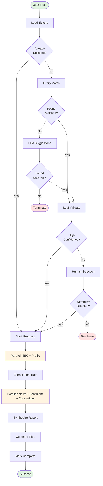

# LangGraph Workflow Documentation
## Deep Research Agent - Financial Intelligence System

**Generated:** 2025-12-09  
**Version:** 1.0  
**Author:** System Analysis

---

## Table of Contents

1. [Overview](#overview)
2. [Architecture](#architecture)
3. [State Management](#state-management)
4. [Workflow Phases](#workflow-phases)
5. [Node Descriptions](#node-descriptions)
6. [Routing Logic](#routing-logic)
7. [Parallel Execution](#parallel-execution)
8. [Error Handling & Resilience](#error-handling--resilience)
9. [Integration Points](#integration-points)
10. [Execution Flow](#execution-flow)

---

## Overview

The Deep Research Agent is a sophisticated LangGraph-based workflow that automates comprehensive financial research on publicly traded companies. It combines SEC EDGAR data, web research, sentiment analysis, and AI-powered synthesis to generate institutional-grade investment research reports.

### Key Features

- **Automated Company Resolution**: Fuzzy matching with LLM validation
- **Human-in-the-Loop (HITL)**: Interactive company selection when needed
- **Parallel Data Collection**: Concurrent fetching of SEC filings, news, and sentiment data
- **LLM-Powered Synthesis**: Context-aware report generation using Google Gemini
- **Intelligent Caching**: Rate-limiting and caching for external APIs
- **Robust Error Handling**: Retry mechanisms and fallback strategies

### Technology Stack

- **LangGraph**: State machine orchestration
- **Google Gemini**: LLM for validation, suggestions, and synthesis
- **SEC EDGAR API**: Financial data and company information
- **Tavily API**: Web search (with DuckDuckGo fallback)
- **Pydantic**: Type-safe state management
- **Streamlit**: Web UI for HITL interaction

---

## Architecture

### System Design

The workflow follows a directed acyclic graph (DAG) pattern with conditional routing and parallel execution capabilities. The architecture is designed for:

1. **Modularity**: Each node is a self-contained function
2. **State Immutability**: State flows through the graph without side effects
3. **Fault Tolerance**: Retry logic and graceful degradation
4. **Performance**: Parallel execution of independent tasks

### Component Structure

```
fire/
├── agents/
│   ├── graph_builder.py      # LangGraph workflow definition
│   └── state.py              # Pydantic state models
├── nodes/                    # Individual workflow nodes
│   ├── company_resolution.py
│   ├── company_validation.py
│   ├── company_suggestions.py
│   ├── sec_data.py
│   ├── web_research.py
│   ├── sentiment_analysis.py
│   ├── synthesis.py
│   └── report_generation.py
├── config/
│   ├── settings.py           # Configuration management
│   └── prompts.py            # LLM prompt templates
└── utils/                    # Helper utilities
    ├── cache.py
    ├── retry.py
    ├── fallback.py
    └── context_manager.py
```

---

## State Management

### ResearchState Model

The entire workflow is driven by a single `ResearchState` object that accumulates data as it flows through the graph.

```python
class ResearchState(BaseModel):
    # Input from user
    company_name: str
    
    # Pipeline tracking
    status: PipelineStatus
    current_node: str
    error_message: Optional[str]
    
    # Company resolution phase
    company_tickers: List[Dict[str, Any]]
    match_options: List[CompanyMatch]
    human_response: Optional[str]
    found: Optional[CompanyMatch]
    cik10: Optional[str]
    
    # LLM validation and suggestions
    llm_validation_passed: bool
    validation_result: Optional[Dict[str, Any]]
    llm_suggestions: List[str]
    
    # SEC financial data
    companyfacts: Dict[str, Any]
    submissions: Dict[str, Any]
    financials_1yr: Optional[FinancialStatements]
    
    # Web research results
    company_profile: Optional[CompanyProfile]
    news_timeline: List[SearchResult]
    social_sentiment: Optional[Dict[str, Any]]
    competitors: List[Dict[str, Any]]
    
    # Final synthesis
    synthesized_insights: Optional[str]
    final_report: Optional[str]
    report_path: Optional[str]
```

### Key State Properties

| Property | Type | Purpose |
|----------|------|---------|
| `company_name` | str | User's input query |
| `found` | CompanyMatch | Resolved company (ticker, CIK, name) |
| `llm_validation_passed` | bool | Whether LLM confirmed match |
| `companyfacts` | Dict | SEC XBRL financial data |
| `financials_1yr` | FinancialStatements | Extracted metrics (income, balance, cashflow) |
| `news_timeline` | List[SearchResult] | Recent news articles |
| `social_sentiment` | Dict | Aggregated sentiment analysis |
| `synthesized_insights` | str | Final LLM-generated report |

### Supporting Models

#### CompanyMatch
```python
class CompanyMatch(BaseModel):
    title: str        # Official company name
    ticker: str       # Stock ticker symbol
    cik_str: str      # SEC Central Index Key
    cik10: str        # Zero-padded 10-digit CIK
```

#### FinancialStatements
```python
class FinancialStatements(BaseModel):
    income_statement: Dict[str, Optional[FinancialMetric]]
    balance_sheet: Dict[str, Optional[FinancialMetric]]
    cashflow: Dict[str, Optional[FinancialMetric]]
    extraction_date: datetime
```

#### SearchResult
```python
class SearchResult(BaseModel):
    title: str
    url: str
    snippet: Optional[str]
    domain: Optional[str]
    published_date: Optional[str]
    content: Optional[str]
    source: Literal["tavily", "ddgs"]
```

---

## Workflow Phases

The workflow is organized into three major phases:

### Phase 1: Company Identification (Resolution)

**Goal**: Identify the correct company from user input

**Pre-Selection Short-Circuit**: If a `CompanyMatch` object is provided to the workflow, this entire phase is skipped and research begins immediately.

**Steps** (when company not pre-selected):
1. Load SEC company ticker database (~13,000 companies)
2. **Check if company pre-selected**: If `state.found` exists → Skip to data collection
3. Fuzzy match user input against company names (uses difflib with 0.55 cutoff, falls back to substring search)
4. **If single exact match found**: LLM validates match
   - **HIGH confidence + YES** → Auto-proceed to data collection
   - **LOW/MEDIUM confidence or NO** → Require HITL
5. **If multiple matches found** (2+): LLM validates top match, usually triggers HITL for user selection
6. **If no matches found**: LLM generates alternative company names → Search suggestions in ticker database → Validate matches
7. Human-in-the-loop (HITL) displays options when:
   - Multiple fuzzy matches found (user must choose)
   - LLM has low confidence in single match
   - LLM rejects the match

### Phase 2: Data Collection (Research)

**Goal**: Gather comprehensive company information

**Steps**:
1. **Parallel Initial Data**: SEC companyfacts + company profile
2. **Financial Extraction**: Parse XBRL data for key metrics
3. **Parallel Deep Research**: News + competitors + investor materials + sentiment

### Phase 3: Synthesis & Reporting

**Goal**: Generate actionable insights

**Steps**:
1. Synthesize all collected data using LLM
2. Generate formatted Markdown report
3. Save to disk (JSON + Markdown)

---

## Node Descriptions

### 1. load_tickers

**File**: `nodes/sec_data.py`  
**Function**: `load_company_tickers(state: ResearchState) -> ResearchState`

**Purpose**: Load the SEC company ticker database containing all publicly traded companies.

**Details**:
- Fetches from: `https://www.sec.gov/files/company_tickers.json`
- Implements caching (24-hour TTL) to reduce API load
- Returns ~13,000 companies with ticker, CIK, and official name
- Rate-limited to respect SEC's 10 requests/second guideline

**Key Logic**:
```python
# Try cache first
cached_tickers = tickers_cache.load()
if cached_tickers:
    state.company_tickers = cached_tickers
    return state

# Fetch from SEC
response = requests.get(SEC_COMPANY_TICKERS_URL)
tickers_list = list(response.json().values())
tickers_cache.save(tickers_list)
state.company_tickers = tickers_list
```

**Output**: Populates `state.company_tickers` with list of all companies

**Next Step**: Routes to `check_if_needs_matching` router to determine if matching is needed:
- If `state.found` is already set (pre-selected company) → Skip to data collection
- If `state.found` is None → Proceed to fuzzy matching

---

### 2. match (fuzzy_match_companies)

**File**: `nodes/sec_data.py`  
**Function**: `fuzzy_match_companies(state: ResearchState) -> ResearchState`

**Purpose**: Find potential company matches using fuzzy string matching.

**Details**:
- Uses Python's `difflib.get_close_matches()` with 0.55 cutoff
- Returns top 5 candidates
- Falls back to substring search if no fuzzy matches
- If still no matches, returns empty list (triggers LLM suggestions path)

**Algorithm**:
```python
# 1. Fuzzy match with difflib (similarity ratio >= 0.55)
matches = difflib.get_close_matches(
    state.company_name,
    company_titles,
    n=5,
    cutoff=0.55
)

# 2. Substring fallback (if no fuzzy matches)
if not matches:
    query_lower = state.company_name.lower()
    matches = [
        title for title in company_titles
        if query_lower in title.lower()
    ][:5]

# 3. Build CompanyMatch objects
state.match_options = [CompanyMatch(...) for match in matches]
```

**Output**: Populates `state.match_options` with 0-5 candidate companies

**Routing Impact**:
- **0 matches** → Routes to `suggest` (LLM suggestions)
- **1 match** → Routes to `validate` (LLM validation)
- **2+ matches** → Routes to `validate` (LLM validation, likely triggers HITL)

---

### 3. suggest (suggest_and_search)

**File**: `agents/graph_builder.py` (composite node)  
**Components**:
- `nodes/company_suggestions.py::suggest_company_names()`
- `nodes/company_suggestions.py::search_suggestions_in_tickers()`

**Purpose**: Use LLM to generate alternative company names when no fuzzy matches found.

**Details**:
- **Triggered only when**: Fuzzy matching returns 0 results
- Calls Google Gemini Flash (fast, cost-effective)
- Generates 5-8 alternative names (official legal names, abbreviations, historical names, ticker-based names)
- Searches each suggested name in ticker database (exact match → partial match)
- Updates `state.match_options` with newly found candidates

**LLM Prompt Strategy**:
```
User Input: "Google"

Generate alternatives:
1. Alphabet Inc
2. Google LLC
3. Alphabet Inc Class A
4. Alphabet Inc Class C

User Input: "FB"

Generate alternatives:
1. Meta Platforms Inc
2. Facebook Inc
3. Meta Platforms Inc Class A
```

**Search Strategy** (`search_suggestions_in_tickers`):
```python
for suggestion in llm_suggestions:
    # 1. Try exact match (case-insensitive)
    if suggestion.lower() in company_titles_lower:
        found_matches.append(match)
    
    # 2. Try partial match (contains)
    else:
        for title in company_titles:
            if suggestion.lower() in title.lower():
                found_matches.append(match)
                break
```

**Output**: Updates `state.match_options` with 0-5 LLM-suggested matches

**Next Step**: Routes to `check_suggestions` router:
- If suggestions found → Validates them with LLM
- If no suggestions found → Terminates workflow (company not in SEC database)

---

### 4. validate (validate_company_match)

**File**: `nodes/company_validation.py`  
**Function**: `validate_company_match(state: ResearchState) -> ResearchState`

**Purpose**: Use LLM to validate if the matched company is correct.

**Details**:
- Validates **top match** from `state.match_options`
- Uses Gemini Flash with low temperature (0.1) for consistency
- Checks: name similarity, well-known status, potential confusion
- Returns confidence level: HIGH, MEDIUM, LOW
- Auto-selects company if validation passes, otherwise triggers HITL

**Validation Criteria**:
1. Name similarity (accounting for abbreviations, legal suffixes like "Inc.", "Corp")
2. Well-known company matching user's likely intent
3. No confusion with other similarly-named companies

**Response Format**:
```
CONFIDENCE: HIGH
MATCH: YES
REASONING: "Apple Inc." is the official name for "Apple"
```

**Decision Logic**:
```python
if confidence == "HIGH" and match_result == "YES":
    # Auto-select company, skip HITL
    state.found = top_match
    state.cik10 = top_match.cik10
    state.llm_validation_passed = True
else:
    # Require human selection
    state.llm_validation_passed = False
```

**Outcomes**:
- **HIGH confidence + MATCH: YES** → Auto-proceeds to data collection (skips HITL)
- **MEDIUM/LOW confidence OR MATCH: NO** → Requires HITL (user selects from options)
- **Multiple matches (2+)** → Usually results in HITL (even if top match validated)

**Output**: 
- Sets `state.llm_validation_passed` (bool)
- Sets `state.validation_result` (dict with confidence, match, reasoning)
- May set `state.found` and `state.cik10` (if auto-selected)

---

### 5. resolve (resolve_company_selection)

**File**: `nodes/sec_data.py`  
**Function**: `resolve_company_selection(state: ResearchState) -> ResearchState`

**Purpose**: Process human's selection when HITL is required.

**Details**:
- Reads `state.human_response` (expected: "1", "2", etc.)
- Validates selection is within bounds
- Sets `state.found` to selected CompanyMatch
- Computes zero-padded CIK (`cik10`) for API calls

**Input Format**:
```python
state.human_response = "1"  # User selects first option
```

**Output**: Populates `state.found` and `state.cik10`

---

### 6. mark_progress

**File**: `agents/graph_builder.py`  
**Function**: `mark_in_progress(state: ResearchState) -> ResearchState`

**Purpose**: Update pipeline status to indicate research has started.

**Details**:
- Simple state update: `state.status = PipelineStatus.RESEARCH_IN_PROGRESS`
- Used as a checkpoint between resolution and data collection phases

**Output**: Updates `state.status`

---

### 7. initial_data (parallel_initial_data)

**File**: `agents/graph_builder.py`  
**Function**: `parallel_initial_data(state: ResearchState) -> ResearchState`

**Purpose**: Fetch SEC financial data and company profile in parallel.

**Details**:
- **Parallel execution** using `asyncio.gather()`
- Fetches two data sources simultaneously:
  1. SEC companyfacts (XBRL financial data)
  2. Company profile (web research)

**Parallel Tasks**:
```python
results = await asyncio.gather(
    fetch_sec_data(state),
    fetch_company_profile(state),
    return_exceptions=True
)
```

**SEC API Endpoints**:
- Companyfacts: `https://data.sec.gov/api/xbrl/companyfacts/CIK{cik10}.json`
- Submissions: `https://data.sec.gov/submissions/CIK{cik10}.json`

**Web Profile Sources**:
- Prioritizes Wikipedia for company overview
- Falls back to official company pages
- Extracts: industry, founded date, headquarters, employees

**Output**: Populates `state.companyfacts`, `state.submissions`, `state.company_profile`

---

### 8. financials (extract_financial_statements)

**File**: `nodes/sec_data.py`  
**Function**: `extract_financial_statements(state: ResearchState) -> ResearchState`

**Purpose**: Parse XBRL companyfacts data to extract key financial metrics.

**Details**:
- Focuses on US-GAAP financial elements
- Filters to **last 1 year** of data only
- Extracts metrics from: income statement, balance sheet, cash flow

**Extracted Metrics**:

| Statement | Metrics |
|-----------|---------|
| Income Statement | Revenues, Operating Income, Net Income |
| Balance Sheet | Assets, Liabilities, Equity |
| Cash Flow | Operating CF, Investing CF, Financing CF |

**Data Filtering**:
```python
cutoff_date = (datetime.utcnow() - timedelta(days=365)).strftime("%Y-%m-%d")

recent_data = [
    item for item in unit_data
    if (item.get("end") or item.get("filed", "")) >= cutoff_date
]
```

**Element Name Fallbacks**:
- Tries multiple XBRL element names per metric
- Example: `Revenues` → `SalesRevenueNet` → `RevenueFromContractWithCustomerExcludingAssessedTax`

**Output**: Populates `state.financials_1yr` with `FinancialStatements` object

---

### 9. deep_research (parallel_deep_research)

**File**: `agents/graph_builder.py`  
**Function**: `parallel_deep_research(state: ResearchState) -> ResearchState`

**Purpose**: Execute four research tasks in parallel for maximum efficiency.

**Details**:
- **Highest degree of parallelization** in the workflow
- Executes 4 independent web research tasks simultaneously
- Uses `asyncio.gather()` with exception handling

**Parallel Tasks**:

#### 9a. fetch_news_timeline
**File**: `nodes/web_research.py`

- Searches for recent company news using Tavily/DuckDuckGo
- Query: `"{company}" news recent earnings OR announcement`
- Returns top 20 articles with title, URL, snippet, date
- Normalizes results into `SearchResult` objects

#### 9b. identify_competitors
**File**: `nodes/web_research.py`

- Identifies top competitors in the company's industry
- Query: `"{company}" competitors {industry} market share`
- Extracts company names using LLM parsing
- Returns up to 8 competitors

#### 9c. extract_investor_materials
**File**: `nodes/web_research.py`

- Searches for investor relations documents
- Query: `"{company}" investor relations annual report 10-K`
- Filters for PDF links and investor pages
- Returns list of document URLs

#### 9d. analyze_social_sentiment
**File**: `nodes/sentiment_analysis.py`

- Scrapes social media snippets (Reddit, Twitter, forums)
- Uses LLM to classify sentiment: BULLISH, BEARISH, NEUTRAL, MIXED
- Aggregates results into `SentimentAggregate` object
- Extracts top discussion themes

**Sentiment Analysis Flow**:
```python
# 1. Scrape snippets
snippets = await scrape_social_snippets(company)

# 2. Batch analyze with LLM
results = await analyze_sentiment_batch(company, snippets)

# 3. Aggregate results
aggregate = SentimentAggregate(
    total_analyzed=len(results),
    bullish=count_bullish,
    bearish=count_bearish,
    neutral=count_neutral,
    mixed=count_mixed,
    top_themes=Counter(themes).most_common(10)
)
```

**Output**: Populates `state.news_timeline`, `state.competitors`, `state.investor_docs`, `state.social_sentiment`

---

### 10. synthesis (synthesize_research)

**File**: `nodes/synthesis.py`  
**Function**: `synthesize_research(state: ResearchState) -> ResearchState`

**Purpose**: Use LLM to synthesize all collected data into coherent insights.

**Details**:
- Uses Google Gemini Pro (higher capability than Flash)
- Implements context window management (max 800K tokens)
- Generates investment-grade analysis

**Context Preparation**:
```python
context = prepare_synthesis_context(state)

# Context includes:
# - Company profile
# - Financial statements
# - News timeline
# - Sentiment analysis
# - Competitors
```

**Context Window Management**:
- Estimates token count for all inputs
- If exceeds limit, intelligently truncates:
  - Summarizes long text fields
  - Limits list sizes
  - Prioritizes recent data

**LLM Prompt Structure**:
```
You are a senior financial analyst preparing an investment research report.

Company: {company_name} ({ticker})
Industry: {industry}

Financial Data:
- Revenues: ${value}
- Net Income: ${value}
...

Recent News:
1. {title} - {date}
...

Sentiment Analysis:
- Bullish: {count}
- Bearish: {count}
...

Task: Generate a comprehensive analysis covering:
1. Company Overview
2. Financial Performance
3. Market Position
4. Risks & Opportunities
5. Investment Thesis
```

**Output**: Populates `state.synthesized_insights` with LLM-generated report

---

### 11. report (generate_report)

**File**: `nodes/report_generation.py`  
**Function**: `generate_report(state: ResearchState) -> ResearchState`

**Purpose**: Format and save the final research report.

**Details**:
- Generates two file formats:
  1. **Markdown** (.md) - Human-readable formatted report
  2. **JSON** (.json) - Machine-readable structured data

**Report Structure** (Markdown):
```markdown
# Investment Research Report: {Company}

**Generated:** {timestamp}
**Ticker:** {ticker} | **CIK:** {cik}

---

## Company Overview
- Industry: {industry}
- Founded: {year}
- Headquarters: {location}
- Employees: {count}

### Business Description
{profile_description}

---

## Financial Analysis

### Key Metrics
| Statement | Metric | Value | Date |
|-----------|--------|-------|------|
| Income | Revenues | ${value} | {date} |
...

---

## Recent News & Events
### {article_title}
**Date:** {date}
**Source:** {domain}

{snippet}

[Read more]({url})

---

## Social Sentiment Analysis
**Total Analyzed:** {count}

### Sentiment Distribution
| Sentiment | Count | Percentage |
|-----------|-------|------------|
| 🟢 Bullish | {count} | {percent} |
| 🔴 Bearish | {count} | {percent} |
...

### Top Discussion Themes
- {theme} ({count} mentions)
...

---

## Competitive Landscape
{competitors list}

---

## LLM Analysis
{synthesized_insights}

---

## Risk Factors & Disclaimers
{standard disclaimers}
```

**File Naming Convention**:
```
{company_slug}_{YYYYMMDD}_{HHMMSS}.md
{company_slug}_{YYYYMMDD}_{HHMMSS}.json
```

**Output**: Saves files to `outputs/reports/` and sets `state.report_path`

---

### 12. mark_complete

**File**: `agents/graph_builder.py`  
**Function**: `mark_complete(state: ResearchState) -> ResearchState`

**Purpose**: Mark pipeline as successfully completed.

**Details**:
- Updates `state.status = PipelineStatus.COMPLETED`
- Sets `state.execution_end = datetime.utcnow()`
- Final checkpoint before workflow termination

**Output**: Updates `state.status` and `state.execution_end`

---

## Routing Logic

The workflow uses conditional routing to handle different scenarios dynamically.

### Router Functions

#### 1. check_if_needs_matching

**Location**: `agents/graph_builder.py`

**Purpose**: Check if company was pre-selected, allowing the workflow to skip the entire resolution phase.

**When This Matters**:
- **Streamlit UI Flow**: User selects company from HITL options → Workflow is restarted with `selected_company` parameter → `state.found` is already populated
- **API Usage**: Caller can pass a `CompanyMatch` object directly to skip matching
- **Programmatic Usage**: When you know the exact CIK/ticker and want to jump straight to research

**Logic**:
```python
def check_if_needs_matching(state: ResearchState) -> str:
    if state.found:
        # Company already resolved (pre-selected)
        # Skip fuzzy matching, LLM validation, and HITL
        return "skip_match"
    else:
        # Normal flow: need to identify company from user input
        return "needs_match"
```

**Routes**:
- `skip_match` → `mark_progress` → Data collection (bypass entire resolution phase)
- `needs_match` → `match` (start fuzzy matching process)

**Example Pre-Selection**:
```python
# Pre-select Apple directly
selected = CompanyMatch(
    title="Apple Inc.",
    ticker="AAPL",
    cik_str="320193"
)

initial_state = ResearchState(
    company_name="Apple",
    found=selected  # Pre-populated
)

# Workflow will skip matching and go straight to data collection
final_state = await run_research_pipeline("Apple", selected_company=selected)
```

---

#### 2. should_validate

**Location**: `agents/graph_builder.py`

**Purpose**: Decide next step after fuzzy matching completes.

**Logic**:
```python
def should_validate(state: ResearchState) -> str:
    if state.found:
        return "data_collection"  # Pre-selected, skip everything
    
    if not state.match_options:
        return "suggest"  # No matches found, try LLM suggestions
    
    # Always validate with LLM first (even for single or multiple matches)
    return "validate"  # LLM will decide if HITL needed
```

**Routes**:
- `data_collection` → `mark_progress` (company pre-selected)
- `suggest` → `suggest` node (0 fuzzy matches → LLM generates alternatives)
- `validate` → `validate` node (1+ matches → LLM validates top match)

**Note**: Even with multiple matches, we route to `validate` first. The LLM validator checks the top match, and if confidence is low or there are multiple options, the `should_resolve` router will trigger HITL.

---

#### 3. check_suggestions

**Location**: `agents/graph_builder.py`

**Purpose**: Check if LLM suggestions found any matches.

**Logic**:
```python
def check_suggestions(state: ResearchState) -> str:
    if state.match_options:
        return "validate"  # Found matches, validate them
    else:
        return "end"  # No matches even with LLM, terminate
```

**Routes**:
- `validate` → `validate` node
- `end` → Workflow termination

---

#### 4. should_resolve

**Location**: `agents/graph_builder.py`

**Purpose**: Determine if HITL is needed after LLM validation.

**Logic**:
```python
def should_resolve(state: ResearchState) -> str:
    # Check if LLM validated with high confidence
    if hasattr(state, 'llm_validation_passed') and state.llm_validation_passed:
        return "data_collection"  # Auto-selected, proceed
    
    # LLM validation failed/low confidence, require human selection
    return "resolve"  # Trigger HITL
```

**Routes**:
- `data_collection` → `mark_progress` (HIGH confidence match, auto-selected)
- `resolve` → `resolve` node (HITL required)

**HITL is triggered when**:
1. LLM validation returns LOW/MEDIUM confidence
2. LLM validation returns MATCH: NO
3. Multiple match candidates exist (even if top match has medium confidence)
4. LLM validation throws an exception (safety fallback)

---

#### 5. is_resolved

**Location**: `agents/graph_builder.py`

**Purpose**: Check if company is resolved after HITL.

**Logic**:
```python
def is_resolved(state: ResearchState) -> str:
    if state.found:
        return "data_collection"  # Human selected company
    else:
        return "end"  # User cancelled or error
```

**Routes**:
- `data_collection` → `mark_progress`
- `end` → Workflow termination

---

## Parallel Execution

### Strategy

The workflow uses `asyncio.gather()` to execute independent tasks concurrently, significantly reducing total execution time.

### Parallelization Points

#### 1. Initial Data Collection

**Nodes**: `fetch_sec_data` + `fetch_company_profile`

**Rationale**: SEC API and web search are independent operations

**Time Savings**: ~50% reduction (sequential: 10s → parallel: 5s)

#### 2. Deep Research

**Nodes**: `fetch_news_timeline` + `identify_competitors` + `extract_investor_materials` + `analyze_social_sentiment`

**Rationale**: All four tasks are independent web/API operations

**Time Savings**: ~75% reduction (sequential: 40s → parallel: 10s)

### Implementation Pattern

```python
async def parallel_deep_research(state: ResearchState) -> ResearchState:
    import asyncio
    
    # Launch all tasks
    results = await asyncio.gather(
        fetch_news_timeline(state),
        identify_competitors(state),
        extract_investor_materials(state),
        analyze_social_sentiment(state),
        return_exceptions=True  # Don't fail entire batch on single error
    )
    
    # Merge results back into state
    for result in results:
        if isinstance(result, Exception):
            logger.error(f"Task failed: {result}")
        elif isinstance(result, ResearchState):
            # Merge fields from result into state
            if result.news_timeline:
                state.news_timeline = result.news_timeline
            # ... merge other fields
    
    return state
```

### Error Handling in Parallel Execution

- `return_exceptions=True` prevents one failure from cancelling all tasks
- Each task result is checked with `isinstance(result, Exception)`
- Failed tasks log errors but don't block successful tasks
- State is only updated with successful results

---

## Error Handling & Resilience

### Retry Mechanism

**Implementation**: `utils/retry.py`

**Decorator Usage**:
```python
@retry(max_attempts=3, exceptions=(requests.RequestException,))
def fetch_data(url):
    response = requests.get(url)
    response.raise_for_status()
    return response.json()
```

**Features**:
- Configurable max attempts (default: 3)
- Exponential backoff (2x per attempt)
- Max wait time cap (60 seconds)
- Exception type filtering

### Fallback Strategies

**Implementation**: `utils/fallback.py`

**Pattern**:
```python
chain = FallbackChain("search")
chain.add_strategy("Tavily", tavily_search)
chain.add_strategy("DuckDuckGo", ddgs_search)
result = chain.execute()  # Tries Tavily first, falls back to DDGS
```

**Use Cases**:
- Web search: Tavily → DuckDuckGo
- LLM calls: Gemini Pro → Gemini Flash (could be configured)

### Rate Limiting

**Implementation**: `utils/retry.py`

**Decorator Usage**:
```python
@rate_limit(calls_per_second=10)
def call_sec_api(url):
    return requests.get(url)
```

**Features**:
- Token bucket algorithm
- Per-function rate limiting
- SEC API: 10 requests/second limit

### Validation

**Implementation**: `utils/validation.py`

**Checks**:
- Data completeness validation
- Type checking with Pydantic
- Business logic validation (e.g., "is financial data reasonable?")

---

## Integration Points

### External APIs

#### 1. SEC EDGAR API

**Base URL**: `https://data.sec.gov/`

**Endpoints**:
- Company Tickers: `/files/company_tickers.json`
- Company Facts: `/api/xbrl/companyfacts/CIK{cik}.json`
- Submissions: `/submissions/CIK{cik}.json`

**Rate Limit**: 10 requests/second

**Authentication**: User-Agent header with email required

**Caching**: 24-hour TTL for ticker database

#### 2. Google Gemini API

**Models Used**:
- **Gemini Flash 2.5** (`gemini-2.5-flash`): Validation, suggestions, sentiment
- **Gemini Pro 2.5** (`gemini-2.5-pro`): Final synthesis

**Context Window**: 1M tokens

**Use Cases**:
- Company name suggestions
- Match validation
- Sentiment classification
- Report synthesis

#### 3. Tavily Search API

**Purpose**: Primary web search provider

**Features**:
- Search depth: "advanced"
- Max results: 10 per query
- Returns: title, URL, snippet, raw content

**Fallback**: DuckDuckGo Search (no API key required)

#### 4. DuckDuckGo Search

**Purpose**: Fallback web search when Tavily unavailable

**Implementation**: `duckduckgo_search` Python library

**Limitations**:
- Rate limiting more aggressive
- No raw content extraction
- Snippet-only results

### File System

**Directory Structure**:
```
outputs/
├── reports/
│   ├── {company}_{timestamp}.md
│   └── {company}_{timestamp}.json
└── workflow_diagram.mmd

data/
├── company_tickers.json (cache)
└── checkpoints.db (future: graph checkpointing)
```

### Streamlit UI

**File**: `app.py`

**Integration Points**:
1. **Input**: User enters company name
2. **HITL**: Displays match options, captures selection
3. **Progress**: Real-time status updates
4. **Results**: Displays final report with download buttons

**State Synchronization**:
- Streamlit session state bridges UI and graph state
- Human response flows: UI → `state.human_response` → graph

---

## Execution Flow

### Complete Workflow Diagram



### Step-by-Step Execution

#### Phase 1: Company Resolution

**Example A: Exact Match (Auto-Selected)**

1. **START**: User enters "Apple Inc" in Streamlit UI
2. **load_tickers**: Load 13,000+ companies from SEC (cached)
3. **check_if_needs_matching**: Not pre-selected → "needs_match"
4. **match**: Fuzzy match finds 1 match:
   - "Apple Inc." (ticker: AAPL, CIK: 0000320193)
5. **should_validate**: 1 match found → "validate"
6. **validate**: LLM validates top match
   - User input: "Apple Inc"
   - Matched: "Apple Inc." (AAPL)
   - LLM response: CONFIDENCE: HIGH, MATCH: YES
   - **Auto-selects company** → Sets `state.found`, `state.llm_validation_passed = True`
7. **should_resolve**: HIGH confidence → "data_collection" ✓ (skips HITL)

**Example B: Multiple Matches (HITL Required)**

1. **START**: User enters "Apple" in Streamlit UI
2. **load_tickers**: Load 13,000+ companies from SEC (cached)
3. **check_if_needs_matching**: Not pre-selected → "needs_match"
4. **match**: Fuzzy match finds 3 matches:
   - "Apple Inc." (ticker: AAPL)
   - "Applied Materials Inc." (ticker: AMAT)
   - "Apple Hospitality REIT Inc." (ticker: APLE)
5. **should_validate**: 3 matches found → "validate"
6. **validate**: LLM validates top match "Apple Inc."
   - User input: "Apple"
   - Top match: "Apple Inc." (AAPL)
   - LLM response: CONFIDENCE: MEDIUM (due to multiple similar names)
   - Does NOT auto-select → Sets `state.llm_validation_passed = False`
7. **should_resolve**: MEDIUM confidence → "resolve" (triggers HITL)
8. **resolve**: User sees 3 options, selects "1" for Apple Inc.
9. **is_resolved**: Company selected → "data_collection" ✓

**Example C: No Match (LLM Suggestions)**

1. **START**: User enters "FB" in Streamlit UI
2. **load_tickers**: Load 13,000+ companies from SEC (cached)
3. **check_if_needs_matching**: Not pre-selected → "needs_match"
4. **match**: Fuzzy match finds 0 matches ("FB" too short, no partial matches)
5. **should_validate**: 0 matches found → "suggest"
6. **suggest**: LLM generates alternatives:
   - "Meta Platforms Inc"
   - "Facebook Inc"
   - Searches in tickers → Finds "Meta Platforms Inc" (ticker: META)
7. **check_suggestions**: 1 match found → "validate"
8. **validate**: LLM validates "Meta Platforms Inc" for input "FB"
   - LLM response: CONFIDENCE: HIGH, MATCH: YES
   - Auto-selects → Sets `state.found = Meta Platforms Inc`
9. **should_resolve**: HIGH confidence → "data_collection" ✓ (skips HITL)

**Example D: Pre-Selected Company (Skips All Matching)**

1. **START**: Streamlit UI - User previously selected "Apple Inc." from HITL, now workflow restarts with selection
2. **load_tickers**: Load 13,000+ companies from SEC (cached)
3. **check_if_needs_matching**: `state.found` already set (Apple Inc., AAPL, CIK: 0000320193) → "skip_match"
4. **mark_progress**: Set status to RESEARCH_IN_PROGRESS ✓
5. → Proceeds directly to data collection (skips steps 4-9 from other examples)

**Use Cases for Pre-Selection**:
- **Streamlit HITL Flow**: After user selects from options, workflow restarts with that selection
- **API Integration**: External system already knows company details
- **Batch Processing**: Processing list of known tickers
- **Re-running Reports**: Regenerate report for previously researched company

#### Phase 2: Data Collection

8. **mark_progress**: Set status to RESEARCH_IN_PROGRESS
9. **initial_data** (parallel):
   - **Thread 1**: Fetch SEC companyfacts for CIK 0000320193
   - **Thread 2**: Search Wikipedia for "Apple Inc. company overview"
   - Wait for both → merge results
10. **financials**: Extract from companyfacts:
    - Revenues: $394.3B (Q4 2024)
    - Net Income: $97.0B
    - Assets: $365.7B
11. **deep_research** (parallel):
    - **Thread 1**: Search news → 20 articles
    - **Thread 2**: Identify competitors → [Microsoft, Google, Samsung, ...]
    - **Thread 3**: Find investor docs → 10-K, proxy statements
    - **Thread 4**: Scrape sentiment → 50 Reddit/Twitter posts → LLM analysis
    - Wait for all → merge results

#### Phase 3: Synthesis & Reporting

12. **synthesis**: 
    - Prepare context (company profile, financials, news, sentiment)
    - Check token count: 45K tokens (within 800K limit)
    - Call Gemini Pro: Generate investment thesis
    - Return: 2,000-word analytical report
13. **report**:
    - Format Markdown with sections
    - Save: `outputs/reports/apple_inc_20251209_143025.md`
    - Save: `outputs/reports/apple_inc_20251209_143025.json`
14. **mark_complete**: Set status to COMPLETED
15. **END**: Return final state to Streamlit

**Total Execution Time**: ~25 seconds
- Resolution: 5s
- Data collection: 12s (parallelized from ~40s)
- Synthesis: 8s

---

## Advanced Features

### Context Window Management

**Challenge**: Gemini Pro has 1M token limit, but research data can be large.

**Solution**: `utils/context_manager.py`

**Strategies**:
1. **Token Estimation**: Count tokens before sending
2. **Prioritization**: Keep most important data (financials > news > sentiment)
3. **Summarization**: Use LLM to summarize long text fields
4. **Truncation**: Limit list sizes (top 10 news articles, top 5 competitors)

**Implementation**:
```python
async def manage_context_window(context, max_tokens=800_000):
    current_tokens = estimate_tokens(context)
    
    if current_tokens > max_tokens:
        # 1. Summarize profile description
        if len(context["profile_description"]) > 2000:
            context["profile_description"] = await summarize_text(
                context["profile_description"],
                max_length=500
            )
        
        # 2. Truncate news list
        context["news_items"] = context["news_items"][:10]
        
        # 3. Limit sentiment samples
        # ... etc
    
    return context
```

### Caching Strategy

**Purpose**: Reduce API load and improve performance

**Cached Data**:
| Data | TTL | Reason |
|------|-----|--------|
| Company tickers | 24 hours | Rarely changes |
| SEC companyfacts | None | Real-time needed |
| Web search results | None | Real-time needed |

**Implementation**: `utils/cache.py`

```python
class JsonFileCache:
    def load(self):
        if not self.file_path.exists():
            return None
        
        mtime = self.file_path.stat().st_mtime
        age = time.time() - mtime
        
        if age > self.ttl:
            return None  # Expired
        
        return json.loads(self.file_path.read_text())
```

### Graph Checkpointing (Future)

**Planned Feature**: LangGraph supports checkpointing for long-running workflows

**Use Cases**:
- Resume interrupted research
- Human-in-the-loop delays (user takes hours to respond)
- Failure recovery

**Implementation** (placeholder):
```python
from langgraph.checkpoint import SqliteSaver

checkpointer = SqliteSaver(settings.CHECKPOINT_DB)
graph = workflow.compile(checkpointer=checkpointer)
```

---

## Performance Metrics

### Typical Execution Times

| Phase | Sequential | Parallel | Improvement |
|-------|-----------|----------|-------------|
| Resolution | 5s | 5s | 0% (not parallelizable) |
| Initial Data | 10s | 5s | 50% |
| Deep Research | 40s | 10s | 75% |
| Synthesis | 8s | 8s | 0% (single LLM call) |
| **Total** | **63s** | **28s** | **55%** |

### Token Usage

| Component | Avg Tokens | Model | Cost (per run) |
|-----------|-----------|-------|----------------|
| Validation | 200 | Gemini Flash | $0.0001 |
| Suggestions | 300 | Gemini Flash | $0.0002 |
| Sentiment (batch) | 5,000 | Gemini Flash | $0.003 |
| Synthesis | 50,000 | Gemini Pro | $0.15 |
| **Total** | **~55,500** | Mixed | **~$0.15** |

### API Call Counts

- SEC API: 3 calls (tickers, companyfacts, submissions)
- Google Gemini: 3-5 calls (validation, suggestions, sentiment, synthesis)
- Tavily/DDGS: 5-8 calls (profile, news, competitors, sentiment sources)

**Total**: ~15 external API calls per workflow execution

---

## Best Practices

### When to Use This Workflow

✅ **Good Use Cases**:
- Deep due diligence on public companies
- Investment research automation
- Competitive intelligence gathering
- Financial data aggregation

❌ **Not Suitable For**:
- Private companies (no SEC data)
- Real-time trading decisions (data is delayed)
- Non-US companies (SEC database only)

### Extending the Workflow

#### Adding a New Node

1. Create node function in `nodes/`
```python
async def my_custom_node(state: ResearchState) -> ResearchState:
    state.current_node = "my_node"
    # ... do work
    state.my_custom_data = result
    return state
```

2. Register in graph builder
```python
workflow.add_node("my_node", my_custom_node)
workflow.add_edge("previous_node", "my_node")
workflow.add_edge("my_node", "next_node")
```

3. Update state model
```python
class ResearchState(BaseModel):
    # ... existing fields
    my_custom_data: Optional[Dict] = None
```

#### Adding a New Router

```python
def my_router(state: ResearchState) -> str:
    if some_condition:
        return "path_a"
    else:
        return "path_b"

workflow.add_conditional_edges(
    "my_node",
    my_router,
    {
        "path_a": "node_a",
        "path_b": "node_b"
    }
)
```

### Configuration

**Environment Variables** (`.env`):
```bash
# Required
GOOGLE_API_KEY=your_key_here
TAVILY_API_KEY=your_key_here
SEC_USER_AGENT="CompanyName contact@email.com"

# Optional
PRIMARY_MODEL=gemini-2.5-pro
SECONDARY_MODEL=gemini-2.5-flash
TAVILY_SEARCH_DEPTH=advanced
MAX_NEWS_ITEMS=20
```

**Settings** (`config/settings.py`):
- All configuration centralized
- Validation on startup
- Type-safe with dataclass pattern

---

## Troubleshooting

### Common Issues

#### 1. "No matches found even with LLM suggestions"

**Cause**: Company not in SEC database (private, non-US, or delisted)

**Solution**: 
- Check if company is publicly traded in US
- Try full legal name
- Check SEC EDGAR manually

#### 2. "Rate limit exceeded"

**Cause**: Too many SEC API requests

**Solution**:
- Check `@rate_limit` decorator is applied
- Verify `SEC_RATE_LIMIT=10` in settings
- Add delay between runs

#### 3. "Context window exceeded"

**Cause**: Too much data for Gemini's 1M token limit

**Solution**:
- Context manager should auto-truncate
- Check `MAX_CONTEXT_TOKENS` setting
- Reduce `MAX_NEWS_ITEMS`, `MAX_SENTIMENT_SAMPLES`

#### 4. "HITL timeout"

**Cause**: User doesn't respond to selection prompt

**Solution**:
- Implement timeout in Streamlit UI
- Add "Cancel" button
- Save checkpoint before HITL (future feature)

### Logging

**Configuration**:
```python
logging.basicConfig(
    level=logging.INFO,
    format='%(asctime)s - %(name)s - %(levelname)s - %(message)s'
)
```

**Log Levels**:
- `INFO`: Normal workflow progress
- `WARNING`: Missing data, fallbacks triggered
- `ERROR`: Failed operations, exceptions caught

**Example Output**:
```
2025-12-09 14:30:25 - nodes.sec_data - INFO - Loading SEC company tickers...
2025-12-09 14:30:25 - nodes.sec_data - INFO - Loaded 13445 tickers from cache
2025-12-09 14:30:26 - nodes.sec_data - INFO - Finding matches for: Apple
2025-12-09 14:30:26 - nodes.sec_data - INFO - Found 3 potential matches
2025-12-09 14:30:27 - nodes.company_validation - INFO - Validating company match with LLM...
2025-12-09 14:30:28 - nodes.company_validation - INFO - ✓ LLM validation passed
2025-12-09 14:30:28 - agents.graph_builder - INFO - 🔀 Parallel: SEC data + Company profile
2025-12-09 14:30:33 - nodes.sec_data - INFO - ✓ Fetched companyfacts
2025-12-09 14:30:33 - nodes.web_research - INFO - ✓ Fetched profile from wikipedia.org
```

---

## Future Enhancements

### Planned Features

1. **Graph Checkpointing**
   - Resume interrupted workflows
   - Handle long HITL delays
   - Disaster recovery

2. **Streaming Synthesis**
   - Real-time report generation
   - Progressive UI updates
   - Better user experience

3. **Multi-Company Analysis**
   - Compare multiple companies
   - Portfolio-level insights
   - Relative valuation

4. **Historical Data**
   - Multi-year financial trends
   - Stock price integration
   - Performance tracking

5. **Custom Data Sources**
   - Plugin architecture
   - User-provided documents
   - Private company data

### Extension Points

- **New LLM Providers**: Add OpenAI, Anthropic, etc.
- **Additional Sentiment Sources**: Twitter API, Stocktwits API
- **Advanced Financials**: Ratio calculations, trend analysis
- **Risk Modeling**: Monte Carlo simulations, scenario analysis
- **Export Formats**: PDF, PowerPoint, Excel

---

## Conclusion

The Deep Research Agent workflow demonstrates best practices for building production-grade LangGraph applications:

1. **Type Safety**: Pydantic models ensure data integrity
2. **Modularity**: Each node is independently testable
3. **Performance**: Parallel execution where possible
4. **Resilience**: Retry logic, fallbacks, error handling
5. **Observability**: Comprehensive logging and status tracking
6. **User Experience**: HITL integration for ambiguous cases

The architecture is designed to be **extensible** (easy to add nodes), **maintainable** (clear separation of concerns), and **production-ready** (error handling, rate limiting, caching).

---

## Appendix

### File Reference

| File | Purpose | Key Functions |
|------|---------|---------------|
| `agents/graph_builder.py` | Workflow definition | `build_graph()`, routers, parallel nodes |
| `agents/state.py` | State models | `ResearchState`, `CompanyMatch`, `FinancialStatements` |
| `nodes/sec_data.py` | SEC API integration | `load_company_tickers()`, `fetch_sec_data()`, `extract_financial_statements()` |
| `nodes/company_validation.py` | LLM validation | `validate_company_match()` |
| `nodes/company_suggestions.py` | LLM suggestions | `suggest_company_names()` |
| `nodes/web_research.py` | Web search | `fetch_company_profile()`, `fetch_news_timeline()`, `identify_competitors()` |
| `nodes/sentiment_analysis.py` | Social sentiment | `analyze_social_sentiment()`, `scrape_social_snippets()` |
| `nodes/synthesis.py` | Report synthesis | `synthesize_research()`, `prepare_synthesis_context()` |
| `nodes/report_generation.py` | File output | `generate_report()`, `format_markdown_report()` |
| `config/settings.py` | Configuration | `Settings` class, API keys, rate limits |
| `config/prompts.py` | LLM prompts | `sentiment_analysis_prompt()`, `research_synthesis_prompt()` |
| `utils/retry.py` | Error handling | `@retry`, `@rate_limit` decorators |
| `utils/fallback.py` | Fallback chains | `FallbackChain` class |
| `utils/cache.py` | Caching | `JsonFileCache` class |
| `utils/context_manager.py` | Token management | `estimate_tokens()`, `summarize_text()` |
| `app.py` | Streamlit UI | `run_research_pipeline()`, HITL interface |

### Dependencies

```txt
# Core
langgraph>=0.0.20
langchain-core>=0.1.0
langchain-google-genai>=0.0.5
pydantic>=2.0.0

# Data Sources
requests>=2.31.0
aiohttp>=3.9.0
tavily-python>=0.3.0
duckduckgo-search>=3.9.0

# Parsing & Formatting
beautifulsoup4>=4.12.0
html2text>=2020.1.16
lxml>=4.9.0

# UI
streamlit>=1.28.0

# Utilities
python-dotenv>=1.0.0
```

### Environment Setup

```bash
# 1. Clone repository
git clone <repo-url>
cd fire

# 2. Create virtual environment
python -m venv venv
source venv/bin/activate  # or `venv\Scripts\activate` on Windows

# 3. Install dependencies
pip install -r requirements.txt

# 4. Configure environment
cp .env.example .env
# Edit .env with your API keys

# 5. Run setup script
bash setup.sh

# 6. Launch application
streamlit run app.py
```

---

**Document Version**: 1.0  
**Last Updated**: 2025-12-09  
**Maintained By**: Development Team

For questions or contributions, please refer to the project repository.
